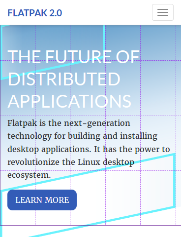

# Flatpak 2.0
This is my flatpak version for original [flatpak](http://flatpak.org/) site using hugo

# Screenshot

# Instructions

Clone/Download the repository and run `hugo server` after you are inside the directory
Open localhost:1313 on browser to see it in action 

